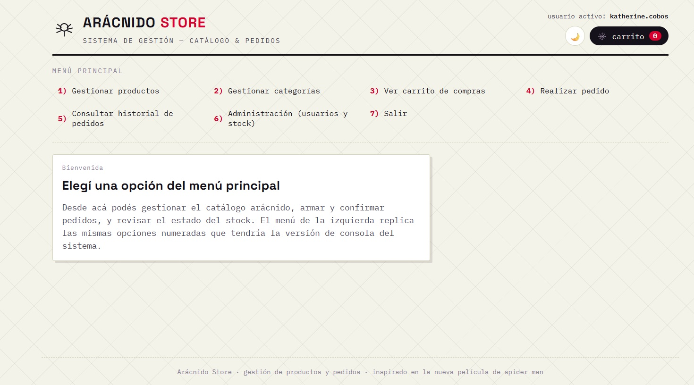

# Arácnido Store

Sistema de gestión de catálogo, carrito y pedidos desarrollado en **JavaScript puro** (sin frameworks), con soporte de **modo claro/oscuro** y una temática de merchandising inspirada en el universo del héroe arácnido de Nueva York.

> Proyecto académico — sistema de consola (menú numerado) llevado a una interfaz web interactiva.



---

## Funcionalidades

- **Gestión de productos** (alta, listado, búsqueda por ID/nombre, actualización de precio/stock, baja con confirmación).
- **Gestión de categorías** (alta y baja, con protección para categorías en uso).
- **Carrito de compras**, con validación de stock disponible por línea.
- **Creación de pedidos**: cálculo automático de totales y descuento de stock al confirmar.
- **Historial de pedidos** con máquina de estados: `pendiente → confirmado → enviado → entregado`, o `cancelado` en cualquier punto anterior a la entrega (con reposición automática de stock si corresponde).
- **Panel de administración**: alertas de stock bajo/agotado y vista general de todos los pedidos.
- **Modo claro / oscuro**, con paleta de colores propia para cada uno.

---

## Tecnologías

- HTML5 semántico
- CSS3 (variables/custom properties, `clip-path`, `grid`, `flexbox`)
- JavaScript (ES6+: clases, template literals, delegación de eventos) — **sin frameworks ni librerías externas**
- Google Fonts (`Space Grotesk`, `Space Mono`, `IBM Plex Mono`)

No usa `localStorage` ni backend: los datos viven en memoria durante la sesión del navegador.

---

## Menú principal

```
1) Gestionar productos
2) Gestionar categorías
3) Ver carrito de compras
4) Realizar pedido
5) Consultar historial de pedidos
6) Administración (usuarios y stock)
7) Salir
```

Dentro de "Gestionar productos":

```
a) Agregar producto
b) Listar productos
c) Buscar producto por ID
d) Actualizar producto
e) Eliminar producto
f) Volver al menú principal
```

---

## Licencia

Este proyecto está bajo la licencia **MIT** — ver [`LICENSE`](./LICENSE) para más detalles.

---

## Autora

**Katherine Cobos** [@kbcobos](https://www.github.com/kbcobos)